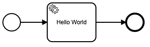
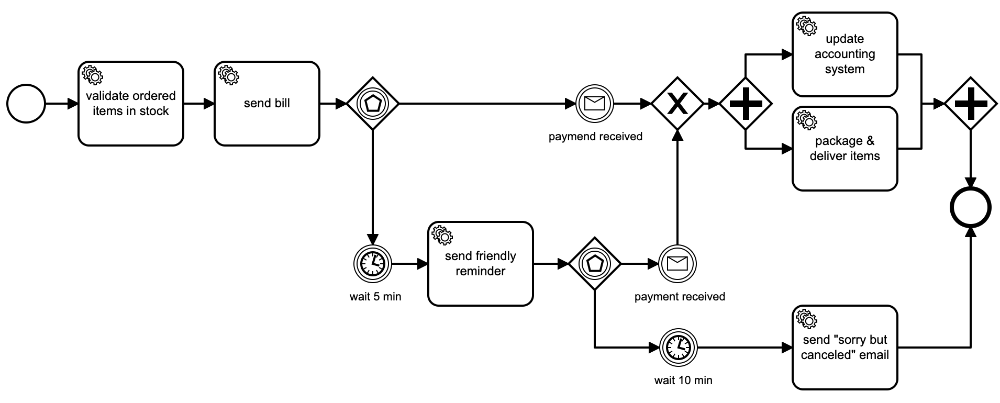

# lib-bpmn-engine

## Motivation

A BPMN engine, meant to be embedded in Go applications with minimum hurdles,
and a pleasant developer experience using it.
This approach can increase transparency of code/implementation for non-developers.

This library is meant to be embedded in your application and should not introduce more runtime-dependencies.
Hence, there's no database support built nor planned.
Also, the engine is not agnostic to any high availability approaches, like multiple instances or similar.

### Philosophies around BPMN

The BPMN specification in its core is a set of graphical symbols (rectangles, arrows, etc.)
and a standard definition about how to read/interpret them.
With this foundation, it's an excellent opportunity to enrich transparency or communication or discussions 
about implementation details. So BPMN has a great potential to support me as a developer to not write
documentation into a wiki but rather expose the business process via well known symbols/graphics.

There's a conceptual similarity in usage between BPMN and OpenAPI/Swagger.
As developers, on the one hand side we often use OpenAPI/Swagger to document our endpoints, HTTP methods, and purpose
of the (HTTP) interface, our services offer. Hence, we enable others to use and integrate them.
With BPMN on the other hand it can be conceptual similar, when it comes to share internal behaviour of our services.
I see even larger similarity, when it comes to the question: *How do I maintain the documentation?*
Again, on the one hand side with OpenAPI/Swagger, we tend to either use reflection and code generators
or we follow the API spec first approach.
The later one is addressed by this library in the BPMN context: **Business Process spec first approach**

### Roadmap

#### ✔ v0.1.0

[progress milestone v0.1.0](///github.com/nitram509/lib-bpmn-engine/issues?q=is%3Aopen+is%3Aissue+milestone%3Av0.1.0)

For the first release I would like to have service tasks and events fully supported.

#### v0.2.0

[progress milestone v0.2.0](///github.com/nitram509/lib-bpmn-engine/issues?q=is%3Aopen+is%3Aissue+milestone%3Av0.2.0)

With basic element support, I would like to add visualization/monitoring capabilities.
If the idea of using Zeebe's exporter protocol is not too complex, that would be ideal.
If not, a simple console logger might do the job as well.

#### v0.3.0

[progress milestone v0.3.0](///github.com/nitram509/lib-bpmn-engine/issues?q=is%3Aopen+is%3Aissue+milestone%3Av0.3.0)

With basic element and visualization support, I would like to add expression language support as well as support for correlation keys


## Build status


[](https://codecov.io/gh/nitram509/lib-bpmn-engine)
[](https://nitram509-lib-bpmn-engine.readthedocs-hosted.com/en/latest/?badge=latest)

## Project status

* very early stage
* contributors welcome

## Documentation

WiP...
https://nitram509-lib-bpmn-engine.readthedocs-hosted.com/

GoDoc: https://pkg.go.dev/github.com/nitram509/lib-bpmn-engine/pkg/bpmn_engine

Requires Go v1.16+

## BPMN Modelling

All these examples are build with [Camunda Modeler Community Edition](https://camunda.com/de/download/modeler/).
I would like to send a big "thank you", to Camunda for providing such tool.

## Usage Examples 

### Hello World

Assuming this simple 'Hello World' BPMN example should just print "hello world". \


Then a simple (and verbose) code to execute this looks like this

<!-- MARKDOWN-AUTO-DOCS:START (CODE:src=./examples/hello_world/hello_world.go) -->
<!-- The below code snippet is automatically added from ./examples/hello_world/hello_world.go -->
```go
package main

import (
	"fmt"
	"github.com/nitram509/lib-bpmn-engine/pkg/bpmn_engine"
)

func main() {
	// create a new named engine
	bpmnEngine := bpmn_engine.New("a name")
	// basic example loading a BPMN from file,
	process, err := bpmnEngine.LoadFromFile("simple_task.bpmn")
	if err != nil {
		panic("file \"simple_task.bpmn\" can't be read.")
	}
	// register a handler for a service task by defined task type
	bpmnEngine.AddTaskHandler("hello-world", printContextHandler)
	// setup some variables
	variables := map[string]string{}
	variables["foo"] = "bar"
	// and execute the process
	bpmnEngine.CreateAndRunInstance(process.ProcessKey, variables)
}

func printContextHandler(job bpmn_engine.ActivatedJob) {
	println("< Hello World >")
	println(fmt.Sprintf("ElementId                = %s", job.ElementId))
	println(fmt.Sprintf("BpmnProcessId            = %s", job.BpmnProcessId))
	println(fmt.Sprintf("ProcessDefinitionKey     = %d", job.ProcessDefinitionKey))
	println(fmt.Sprintf("ProcessDefinitionVersion = %d", job.ProcessDefinitionVersion))
	println(fmt.Sprintf("CreatedAt                = %s", job.CreatedAt))
	println(fmt.Sprintf("Variable 'foo'           = %s", job.GetVariable("foo")))
	job.Complete() // don't forget this one, or job.Fail("foobar")
}
```
<!-- MARKDOWN-AUTO-DOCS:END -->

### A microservice API example

The following example snippet shows how a microservice could use BPMN engine
to process orders and provides status feedback to clients.

For this example, we leverage messages and timers, to orchestrate some tasks. 


For this microservice, we first define some simple API.
<!-- MARKDOWN-AUTO-DOCS:START (CODE:src=./examples/ordering_microservice/ordering_microservice_routes.go) -->
<!-- The below code snippet is automatically added from ./examples/ordering_microservice/ordering_microservice_routes.go -->
```go
package main

import "net/http"

func initHttpRoutes() {
	http.HandleFunc("/api/order", handleOrder)                                        // POST new or GET existing Order
	http.HandleFunc("/api/receive-payment", handleReceivePayment)                     // webhook for the payment system
	http.HandleFunc("/show-process.html", handleShowProcess)                          // shows the BPMN diagram
	http.HandleFunc("/index.html", handleIndex)                                       // the index page
	http.HandleFunc("/", handleIndex)                                                 // the index page
	http.HandleFunc("/ordering-items-workflow.bpmn", handleOrderingItemsWorkflowBpmn) // the BPMN file, for documentation purpose
}
```
<!-- MARKDOWN-AUTO-DOCS:END -->

Then we initialize the BPMN engine and register a trivial handler, which just prints on STDOUT.
<!-- MARKDOWN-AUTO-DOCS:START (CODE:src=./examples/ordering_microservice/ordering_microservice_bpmn.go) -->
<!-- The below code snippet is automatically added from ./examples/ordering_microservice/ordering_microservice_bpmn.go -->
```go
package main

import (
	"fmt"
	"github.com/nitram509/lib-bpmn-engine/pkg/bpmn_engine"
	"time"
)

func initBpmnEngine() {
	bpmnEngine = bpmn_engine.New("Ordering-Microservice")
	process, _ = bpmnEngine.LoadFromBytes(OrderingItemsWorkflowBpmn)
	bpmnEngine.AddTaskHandler("validate-order", printHandler)
	bpmnEngine.AddTaskHandler("send-bill", printHandler)
	bpmnEngine.AddTaskHandler("send-friendly-reminder", printHandler)
	bpmnEngine.AddTaskHandler("update-accounting", updateAccountingHandler)
	bpmnEngine.AddTaskHandler("package-and-deliver", printHandler)
	bpmnEngine.AddTaskHandler("send-cancellation", printHandler)
}

func printHandler(job bpmn_engine.ActivatedJob) {
	// do important stuff here
	println(fmt.Sprintf("%s >>> Executing job '%s'", time.Now(), job.ElementId))
	job.Complete()
}

func updateAccountingHandler(job bpmn_engine.ActivatedJob) {
	println(fmt.Sprintf("%s >>> Executing job '%s'", time.Now(), job.ElementId))
	println(fmt.Sprintf("%s >>> update ledger revenue account with amount=%s", time.Now(), job.GetVariable("amount")))
	job.Complete()
}
```
<!-- MARKDOWN-AUTO-DOCS:END -->

Since the ```/api/order``` endpoint can be requested with the GET or POST method,
we need to make the handler smart enough to either create an order process instance or respond a status
<!-- MARKDOWN-AUTO-DOCS:START (CODE:src=./examples/ordering_microservice/ordering_microservice_order.go) -->
<!-- The below code snippet is automatically added from ./examples/ordering_microservice/ordering_microservice_order.go -->
```go
package main

import (
	_ "embed"
	"fmt"
	"net/http"
	"strconv"
)

func handleOrder(writer http.ResponseWriter, request *http.Request) {
	if request.Method == "POST" {
		createNewOrder(writer, request)
	} else if request.Method == "GET" {
		showOrderStatus(writer, request)
	}
}

func createNewOrder(writer http.ResponseWriter, request *http.Request) {
	instance, _ := bpmnEngine.CreateAndRunInstance(process.ProcessKey, nil)
	redirectUrl := fmt.Sprintf("/show-process.html?orderId=%d", instance.GetInstanceKey())
	http.Redirect(writer, request, redirectUrl, http.StatusFound)
}

func showOrderStatus(writer http.ResponseWriter, request *http.Request) {
	orderIdStr := request.URL.Query()["orderId"][0]
	orderId, _ := strconv.ParseInt(orderIdStr, 10, 64)
	instance := bpmnEngine.FindProcessInstanceById(orderId)
	if instance != nil {
		// we re-use this GET request to ensure we catch up the timers - ideally the service uses internal timers instead
		bpmnEngine.RunOrContinueInstance(instance.GetInstanceKey())
		bytes, _ := prepareJsonResponse(orderIdStr, instance.GetState(), instance.GetCreatedAt())
		writer.Header().Set("Content-Type", "application/json")
		writer.Write(bytes)
		return
	}
	http.NotFound(writer, request)
}
```
<!-- MARKDOWN-AUTO-DOCS:END -->

Also, for the incoming payments, our microservice provides an endpoint so that we get informed
by external payment service. This handler sends a message to the process instance and continues.
<!-- MARKDOWN-AUTO-DOCS:START (CODE:src=./examples/ordering_microservice/ordering_microservice_payments.go) -->
<!-- The below code snippet is automatically added from ./examples/ordering_microservice/ordering_microservice_payments.go -->
```go
package main

import (
	_ "embed"
	"net/http"
	"strconv"
)

func handleReceivePayment(writer http.ResponseWriter, request *http.Request) {
	orderIdStr := request.FormValue("orderId")
	amount := request.FormValue("amount")
	if len(orderIdStr) > 0 && len(amount) > 0 {
		orderId, _ := strconv.ParseInt(orderIdStr, 10, 64)
		processInstance := bpmnEngine.FindProcessInstanceById(orderId)
		if processInstance != nil {
			processInstance.SetVariable("amount", amount)
			bpmnEngine.PublishEventForInstance(processInstance.GetInstanceKey(), "payment-received")
			bpmnEngine.RunOrContinueInstance(processInstance.GetInstanceKey())
			http.Redirect(writer, request, "/", http.StatusFound)
			return
		}
	}
	writer.WriteHeader(400)
	writer.Write([]byte("Bad request: the request must contain form data with 'orderId' and 'amount', and the order must exist"))
}
```
<!-- MARKDOWN-AUTO-DOCS:END -->

To get the snippet compile, see the other sources in the
[examples/ordering_microservice/](./examples/ordering_microservice/) folder.

## Supported BPMN elements
* Start Event
* End Event
* Service Task
  * Get & Set variables from/to context (of the instance)
* Forks
  * controlled and uncontrolled forks are supported
  * parallel gateway supported
  * exclusive gateway with conditions
* Joins
  * uncontrolled and exclusive joins are supported
  * parallel joins are supported
* Message Intermediate Catch Event
  * at the moment, just matching/correlation by name supported
  * TODO: introduce correlation key
* Timer Intermediate Catch Event

## Implementation notes

### IDs (process definition, process instance, job, events, etc.)

This engine does use an implementation of [Twitter's Snowflake algorithm](https://en.wikipedia.org/wiki/Snowflake_ID)
which combines some advantages, like it's time based and can be sorted, and it's collision free to a very large extend.
So you can rely on larger IDs were generated later in time, and they will not collide with IDs,
generated on e.g. other nodes of your application in a multi-node installation.

The IDs are structured like this ...
```
+-----------------------------------------------------------+
| 41 Bit Timestamp |  10 Bit NodeID  |   12 Bit Sequence ID |
+-----------------------------------------------------------+
```

The NodeID is generated out of a hash-function which reads all environment variables.
As a result, this approach allows 4096 unique IDs per node and per millisecond.
