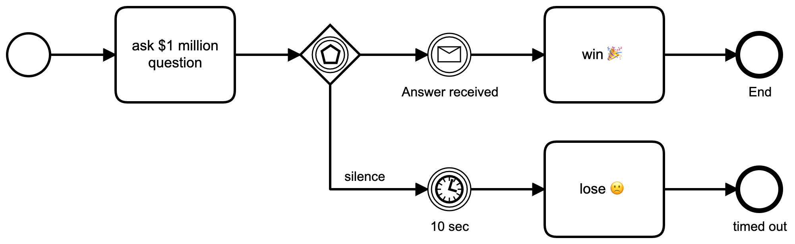

## Timers

The lib-bpmn-engine supports *timer intermediate catch events*,
which are very useful to model typical timeout scenarios.
The one above "ask $1 million question" demonstrates a 10 seconds timeout to give the correct answer or lose.

### How to define timers?

tbc ...
